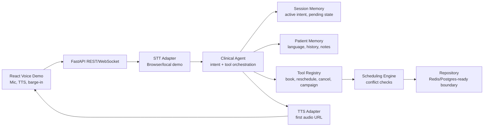

# Real-Time Multilingual Voice AI Agent

Clinical appointment booking demo for English, Hindi, and Tamil conversations.

## What Is Included

- Python FastAPI backend with a traceable agent loop.
- TypeScript React demo for inbound calls, outbound reminders, browser STT, browser TTS, and barge-in.
- Appointment scheduling tools that prevent double booking, past slots, and unknown doctor bookings.
- Session memory plus cross-session patient preferences.
- Per-turn latency breakdown from speech end/transcript receipt to first audio URL.
- Architecture diagram in [docs/architecture.pdf](docs/architecture.pdf) and Mermaid source in [docs/architecture.mmd](docs/architecture.mmd).
- Loom recording guide in [docs/loom-walkthrough.md](docs/loom-walkthrough.md).
- Demo output checklist in [docs/demo-output.md](docs/demo-output.md).

## Quick Start

Backend:

```bash
cd backend
python -m venv .venv
.venv\Scripts\activate
pip install -r requirements.txt
uvicorn app.main:app --reload --host 127.0.0.1 --port 8000
```

Frontend:

```bash
cd frontend
npm install
npm run dev
```

Open the polished demo app:

```text
http://127.0.0.1:8010/app
```

Swagger remains available at:

```text
http://127.0.0.1:8010/docs
```

## Demo Prompts

- English: `Book an appointment with Dr Iyer tomorrow at 12`
- Conflict: run the same prompt twice for the same doctor and slot.
- Hindi: `नमस्ते, appointment book karna hai kal 10 baje`
- Tamil: `வணக்கம், நாளை appointment புக் செய்ய வேண்டும்`
- Reschedule: `Change my appointment to tomorrow evening`
- Cancel: `Cancel my appointment`
- Outbound rejection: click `Reminder`, then send `No, not now please`

## Architecture



The diagram artifact requested for submission lives at `docs/architecture.pdf`.

## Agentic Reasoning And Tool Orchestration

The agent does not return fixed canned responses directly from routes. Each turn flows through:

1. STT adapter.
2. Language detection with patient preference persistence.
3. Intent selection.
4. Tool calls through `ToolRegistry`.
5. Scheduling or campaign state mutation.
6. TTS adapter.
7. Trace and latency emission.

Every response includes a `trace` array with tool name, arguments, result, and tool elapsed time. This is meant to make reasoning demonstrable during the Loom walkthrough.

## Memory Design

Active session memory is stored in `SessionState`:

- current language
- active intent
- pending confirmation
- turn count
- transcript

Cross-session memory is stored on the patient profile:

- language preference
- preferred doctor
- notes and prior preferences
- future extension point for appointment history and embeddings

The repository is currently in memory to keep the demo runnable. The boundary is intentionally isolated in `backend/app/services/repository.py`, so Redis with TTL can replace session storage and Postgres can replace appointment/profile storage without changing the agent or tools.

Recommended production layout:

- Redis: session state, TTL 30-60 minutes, campaign call locks.
- Postgres: patients, doctors, appointments, campaigns, audit logs.
- Vector store: summarized previous conversations retrieved by patient ID and specialty.

## Latency Budget

Target: under 450 ms from speech end to first audio response.

The demo measures from transcript receipt because browser STT performs speech capture before the backend receives the turn. Response payloads include:

- `stt_ms`
- `language_ms`
- `reasoning_ms`
- `tts_ms`
- `first_audio_ready_ms`
- `total_ms`

On a local deterministic run, these should be far below 450 ms. With production STT/TTS/LLM providers, the intended optimizations are:

- streaming STT with endpointing
- small intent/tool planning model before larger fallback model
- cached patient context
- pre-warmed TTS voices
- respond with first audio chunk before full synthesis completes
- WebSocket transport to avoid request setup overhead

## Outbound Campaign Mode

`POST /api/campaigns/reminders?patient_id=p001` creates a reminder campaign. A subsequent agent turn with `channel=outbound` and the returned `campaign_id` logs accepted or declined outcomes. The frontend `Reminder` button drives this path.

For production, a background queue such as Celery, Dramatiq, or BullMQ would schedule calls, enforce retries, and integrate with telephony providers.

## Tradeoffs

- STT/TTS are local adapters for demoability. The interfaces are ready for Deepgram, Azure Speech, ElevenLabs, or Twilio Media Streams.
- Language detection is lightweight and deterministic. Production should use streaming language ID plus user preference.
- Intent planning is rule-led to keep latency predictable. A production version can route ambiguous turns to an LLM planner while preserving the same tool registry.
- In-memory data is not durable. It is deliberately behind a repository boundary.

## Known Limitations

- Browser microphone support depends on Chrome-compatible Web Speech APIs.
- No real telephony provider is wired in.
- No authentication or PHI-grade security is included in this assignment demo.
- Tamil/Hindi responses are simple localized templates, not fully natural LLM generations.

## Tests

```bash
cd backend
pytest
```
